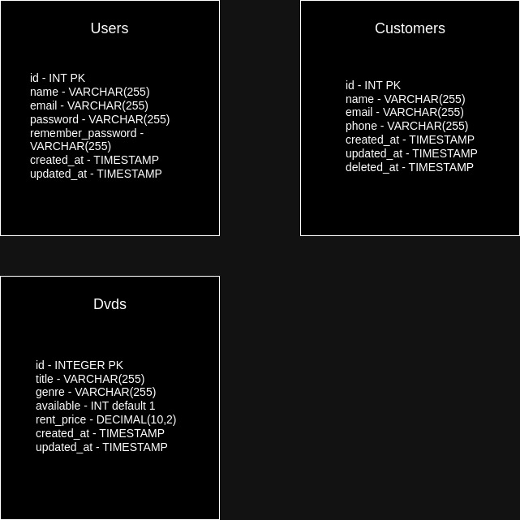

## Instruções

O teste foi desenvolvido conforme os requisitos, porém adicionei uma camada de autenticação do user “John Doe”, que neste exemplo é o nosso user admin.

*   Adicionei usuário, partindo do princípio que poderia ser consumido por um front, e que em um caso mais próximo do real, precisaria de ter autorização para atualizar todas as informações sobre DVD's, clientes e atualizar status do DVD, se está disponível, ou locado.

## 🚀 Como executar o projeto?

*   Primeiro, precisa ter o PHP 5.2 ou superior instalados, conforme exigências do Laravel 11, versão que escolhi para usar.
*   Configurar o .env com as credenciais do banco de dados MySQL.
*   Instalar via composer com o comando `composer install`
*   Executar o comando `php artisan migrate` para criar todas as tabelas no banco de dados
*   Para o usuário “John Doe”, execute o seguinte comando `php artisan db:seed --class=UserAdminSeeder`

| Dados do User admin para gerar o access token |
| --- |
| **nome de usuário:** John Doe |
| **email para login:** johndoe@example.com |
| **password padrao**: johndoe123 |

Shh! 🤫 Essas crdenciais são apenas as geradas pelo seeder, para nosso user admin exemplo.

## Jobs

Para manter as jobs em execução, para as atualizações de status do DVD, para alugado (valor do campo available para “0”), inicie a execução das filas pelo Laravel com o comando `php artisan queue:work`

## Schedule Cron

Temos as tarefas agendadas por meio do Schedule, no arquivo routes/console.php, onde ficam esses comandos agendados.

Com o comando `php artisan schedule:run` você pode executar as tarefas agendadas localmente, porém não ligadas ao CRON.

O comando `php artisan schedule:list` lista as tarefas executadas no terminal localmente.

Se quiser executar em um Linux similar ao que seria em produção, usando CRON, pode fazer o seguinte, `crontab -e` e executar no formato:  
`* * * * * cd /path-to-your-project & php artisan schedule:run >> /dev/null 2>&1` para executar como se fosse em produção.

Lembre-se de substituir o path do projeto para a pasta em que está rodando, caso for em uma máquina com Linux.

## Usando a API

As requisições estão em uma collection do Postman que está em um arquivo chamado: Teste Euro17.postman_collection.json

## Diagrama do banco de dados

Coloquei um diagrama simples do banco, pois como nesse projeto não foi feito relacionamento entre as tabelas, não foi necessário colocar o N:1 1:N e nem mesmo as tabelas de tratamento N:N que seria o caso, se um projeto como esse for ajustado para usar no mundo real.

Mas deixo meu singelo diagrama, detalhando as tabelas criadas (tabelas não padrão do Laravel), seus campos e o tipo de cada campo.

## Informações complementares

*   A job de update de status de locação, para locação, foi pensada para absorver mudanças, como poder vincular a um campo ex.: customer\_id na própria tabela dvds, ou ainda uma tabela contendo as locações do dvd e os clientes vinculados a ela, e também a possibilidade de alterar para que receba dinamicamente o status que deve atribuir, podendo assim servir como uma job coringa, e que serviria tanto para locação (available = 0 - Indisponível para locação), ou (available = 1 disponível para locação).
*   Adicionei autenticação com um usuário Admin de exemplo, supondo que seria consumida por um front end, e que este teria que ter uma proteção das rotas do CRUD, e também que seriam somente pessoas autorizadas que poderiam manipular informações, seja de DVD's ou clientes.
*   Optei por retornar os dados do dvd que foi atualizado, criado ou excluído, e o mesmo para clientes, pois pode ser útil em um front end para exibir ao usuário qual o DVD ou o cliente que foi alterado, criado ou excluído, ficando mais informativo, do que apenas retornando o status http correspondente à ação, isso pensando em uma melhor experiência tanto do front end como do usuário.